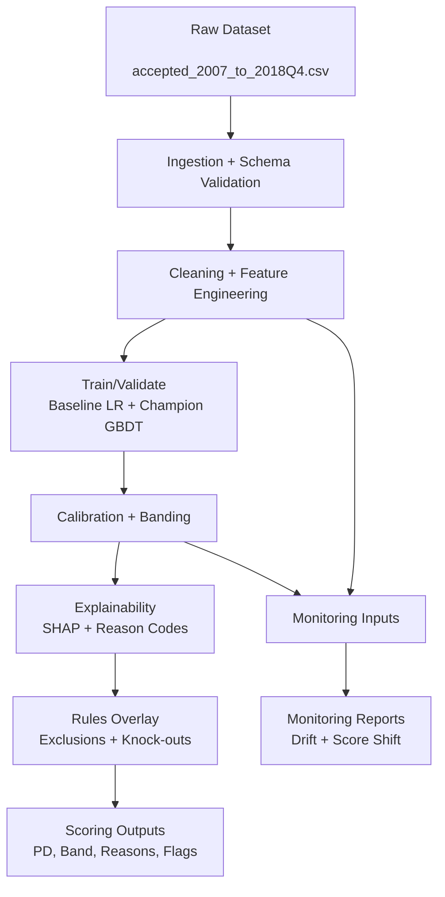

# Technical Architecture Document (TAD)
## RiskSense AI — Bank-Grade ML Risk Intelligence (Malaysia-Aligned System)

| Field | Value |
| :--- | :--- |
| Document Version | 1.1 |
| Status | UPDATED (Reference Draft) |
| Date | 2026-01-06 |

---

## 1. Purpose
This document defines a practical, auditable architecture for RiskSense AI.

It is intentionally designed to be:
- explainability-first
- stable and reproducible
- modular enough for validation
- not overengineered (local-first, simple interfaces)

---

## 2. System Summary
RiskSense AI is a batch-oriented ML system that:
1) trains a PD model (baseline + champion)
2) produces calibrated scores and risk bands
3) generates reason codes (explainability)
4) applies a rules overlay (guardrails)
5) produces monitoring reports (drift + score distribution)

Optional (system enhancement, not required for MVP):
- a small API (FastAPI) to score a single record
- a simple dashboard (Streamlit) to view system summaries

---

## 3. Architecture Principles
1) Human-in-the-loop: output is a recommendation, not an approval.
2) Time-aware evaluation: avoid leakage; prefer out-of-time validation.
3) Traceability: every run produces artifacts (config, metrics, model hash).
4) Explainability as a first-class output: no score without reasons.
5) Minimal moving parts: local storage, Python scripts, and clear modules.

---

## 4. High-Level Component Diagram

---

## 5. Data Inputs
### 5.1 Source datasets in this workspace
Canonical raw sources (preferred):
- `accepted_2007_to_2018Q4.csv.gz`
- `rejected_2007_to_2018Q4.csv.gz`

Extracted convenience copies:
- `accepted_2007_to_2018q4.csv/accepted_2007_to_2018Q4.csv`
- `rejected_2007_to_2018q4.csv/rejected_2007_to_2018Q4.csv`

Additional dataset:
- `Loan_Default.csv`

### 5.2 How each dataset is used (MVP)
- PD model training/evaluation: accepted Lending Club dataset
- Optional bias/coverage analysis: rejected applications dataset
- Optional robustness/secondary experiments: Loan_Default.csv

---

## 6. Data Processing & Feature Engineering
### 6.1 Validation (fail-fast)
The ingestion step produces a data quality report and can fail fast if:
- required columns are missing
- high missingness breaches defined thresholds
- values violate basic sanity checks (e.g., negative income where applicable)

Implementation options:
- MVP: custom validation rules (pandas-based)
- Optional: Great Expectations for more formal checks

### 6.2 Leakage prevention
RiskSense AI must explicitly:
- define the target label and performance window
- exclude post-outcome features
- split train/validation/test by time

### 6.3 Feature types
- Application/static features: borrower and loan attributes at origination
- Derived ratios: normalized risk signals (where feasible)
- Time-aware evaluation features: derived from timestamped fields to enable out-of-time splits and monitoring cohorts

Note: Lending Club is not transactional. “Early warning” is implemented as deterioration proxies and cohort monitoring rather than true streaming signals.

---

## 7. Model Layer
### 7.1 Baseline model
Logistic Regression (interpretable benchmark). Purpose:
- sanity check
- challenger model for governance

### 7.2 Champion model
XGBoost or LightGBM (tabular workhorse in regulated finance). Purpose:
- improved discrimination
- ability to manage nonlinearities and interactions

### 7.3 Calibration
The system calibrates predicted probabilities to improve decision consistency:
- sigmoid or isotonic calibration

### 7.4 Outputs
For each scored record:
- PD (0–1)
- risk band
- recommended action (approve / manual review / recommend decline)
- data quality flags and uncertainty flags

---

## 8. Explainability Layer
### 8.1 Global explainability
- feature importance (model-native + SHAP summary)

### 8.2 Local explainability
- top-N driver contributions per record
- reason code mapping from technical feature name to business label

### 8.3 Explainability acceptance criteria
- reasons must be consistent (same feature naming across runs)
- reasons must be interpretable (human-readable labels)

---

## 9. Rules Overlay (Guardrails)
Rules are separate from ML and applied consistently:
1) Exclusions (do-not-score)
2) Knock-out policy rules (recommend decline regardless of PD)
3) PD-based banding and review routing

This keeps the system defensible: policy is explicit, model is a risk estimator.

---

## 10. Monitoring & Reporting
### 10.1 Data drift
Monitor distribution shifts between reference (training) and current periods:
- PSI-style drift per feature
- missingness drift

### 10.2 Score drift
Monitor score distribution changes:
- PD distribution shift
- risk band migration

### 10.3 Outputs
- a concise Green/Amber/Red monitoring report for a given period
- recommended actions (investigate, retrain candidate, freeze scoring)

---

## 11. Interfaces
### 11.1 MVP interface
Batch scripts/notebooks that:
- train + evaluate
- generate scoring outputs
- generate monitoring reports

### 11.2 Optional interface
- FastAPI endpoint for single-record scoring (system demo)
- Streamlit page for monitoring visualization (system demo)

---

## 12. Technology Stack (MVP vs optional)
### 12.1 MVP
- Python 3.10+
- pandas, NumPy
- scikit-learn
- XGBoost or LightGBM
- SHAP
- Matplotlib/Plotly for plots

### 12.2 Optional (only if it adds signal)
- Great Expectations (formal data checks)
- Evidently (drift reporting helper)
- FastAPI (thin scoring API)
- Streamlit (thin dashboard)

---

## 13. Security, Privacy, and Auditability
- No PII: this system uses public proxy data; do not add identity fields
- Reproducibility: fixed configs, stored metrics, deterministic splits
- Audit trail: every run writes a timestamped artifact bundle with:
  - dataset reference
  - feature list
  - model parameters
  - evaluation metrics
  - monitoring results
