# RiskSense AI

**Bank-Grade ML Risk Intelligence Platform**

> Decision-support PD scoring + explainability + drift monitoring (Malaysia-aligned)


---

## 🎯 Business Problem

Banks lose millions annually due to:
- **Static risk models** that fail to adapt to economic shifts
- **Black-box AI** that is unusable in regulated environments
- **Late detection** of at-risk customers (post-default intervention)

**RiskSense AI** solves this by providing:
- Probability of Default (PD) scoring with calibrated outputs
- Early warning signals before default occurs
- Per-customer explainability for audit compliance
- Continuous monitoring for data and prediction drift

---

## 🏗️ System Architecture

```mermaid
flowchart TB
    subgraph Data["📊 Data Layer"]
        RAW[Raw Data]
        PROC[Processed Data]
    end
    
    subgraph Features["⚙️ Feature Engineering"]
        STATIC[Static Features]
        TEMPORAL[Rolling Windows<br/>7d / 30d / 90d]
        DERIVED[Derived Signals]
    end
    
    subgraph Models["🤖 Model Layer"]
        BASELINE[Baseline LR]
        CHAMPION[Champion GBDT]
        RULES[Rule Engine]
    end
    
    subgraph Explain["🔍 Explainability"]
        GLOBAL[Global SHAP]
        LOCAL[Local SHAP]
        REASONS[Reason Codes]
    end
    
    subgraph Monitor["📈 Monitoring"]
        DRIFT[Data Drift]
        PSI[Score Stability]
        ALERTS[Alert System]
    end
    
    RAW --> PROC
    PROC --> Features
    Features --> Models
    Models --> Explain
    Models --> Monitor
    Explain --> OUTPUT[Decision Support]
    Monitor --> OUTPUT
```



---

## ✨ Key Features

| Module | Capability |
|--------|------------|
| **PD Modeling** | Baseline Logistic Regression + Champion Gradient Boosted Trees + Calibration |
| **Explainability** | Global feature importance + Local per-customer reason codes |
| **Monitoring** | Population Stability Index (PSI) + Feature drift detection |
| **Decision Support** | Exclusion rules + KO flags + Manual review routing |

---

## 📥 Data Setup
> **Note:** Due to file size limits, the raw datasets are not included in the repository. Please download them from the official sources:

1. **Lending Club Loan Data (2007-2018Q4)** - [Download from Kaggle](https://www.kaggle.com/wordsforthewise/lending-club)
   - Download `accepted_2007_to_2018Q4.csv.gz`
   - Place in `data/raw/` (or extract to `data/raw/accepted_2007_to_2018Q4.csv`)

2. **Loan Default Prediction Dataset** - [Download from Kaggle](https://www.kaggle.com/datasets/nikhil1e9/loan-default)
   - Download `Loan_Default.csv`
   - Place in `data/raw/`

---

## 🚀 Quick Start

### Option 1: Windows Launcher (Easiest)

```batch
# Clone and run setup
git clone https://github.com/yourusername/risksense-ai.git
cd risksense-ai
setup.bat          # First-time setup
launcher.bat       # Interactive menu
```

### Option 2: Manual Setup

```bash
# Clone the repository
git clone https://github.com/yourusername/risksense-ai.git
cd risksense-ai

# Create virtual environment (standardized name: .venv)
python -m venv .venv

# Activate environment
# On Windows:
.venv\Scripts\activate
# On Mac/Linux:
source .venv/bin/activate

# Install dependencies
pip install -r requirements.txt
```

### Usage

```bash
# Train models (full dataset - ~5 min)
python -m src.train

# Train models (quick - 10K sample)
python -c "from src import train; train.train_pipeline(sample_n=10000)"

# Start API server
uvicorn api.main:app --reload

# Run tests
pytest tests/ -v

# Open demo notebook
jupyter notebook notebooks/
```

### Model Performance (Trained on 1.37M loans)

| Model | AUC-ROC | Gini | Status |
|-------|---------|------|--------|
| Baseline (Logistic Regression) | 0.6796 | 0.3592 | ❌ |
| **Champion (XGBoost)** | **0.7160** | **0.4320** | ✅ Selected |

---

## 📁 Project Structure

```text
risksense-ai/
├── data/                 # Data assets
│   └── raw/              # Lending Club dataset (1.6 GB)
├── models/               # Trained models (joblib)
├── notebooks/            # Demo Jupyter notebook
├── src/                  # Core ML modules
│   ├── config.py         # Configuration & paths
│   ├── ingestion.py      # Data loading
│   ├── features.py       # Feature engineering
│   ├── train.py          # Model training
│   ├── score.py          # Batch scoring
│   ├── explain.py        # SHAP explanations
│   ├── rules.py          # Business rules
│   ├── monitor.py        # Drift detection
│   └── visualize.py      # Plotting functions
├── api/                  # FastAPI endpoints
├── tests/                # Unit & integration tests
├── DOC/                  # Documentation (9 files)
├── logs/                 # Runtime logs
├── setup.bat             # First-time setup
├── launcher.bat          # Interactive menu
├── requirements.txt
└── README.md
```

---

## 📚 Documentation

Detailed documentation is available in the `DOC/` folder:

| Document | Description |
|----------|-------------|
| [Product Requirements](DOC/1_Product_Requirements_Document.md) | Business objectives and scope |
| [Technical Architecture](DOC/2_Technical_Architecture_Document.md) | System design and data flow |
| [Module Design](DOC/3_Module_Design_Specification.md) | Component specifications |
| [Model Governance](DOC/4_Model_Validation_Governance.md) | Validation and compliance |
| [Rule Document](DOC/5_Rule_Document.md) | Business rules and exclusions |

---

## ⚠️ Disclosure

This is a **reference implementation** using publicly available proxy data (Lending Club) for educational and research purposes.

- Not intended as production banking advice
- No real customer data is used
- Designed to implement ML engineering practices aligned with Malaysian banking requirements

---

## 📄 License

MIT License - See [LICENSE](LICENSE) for details.
